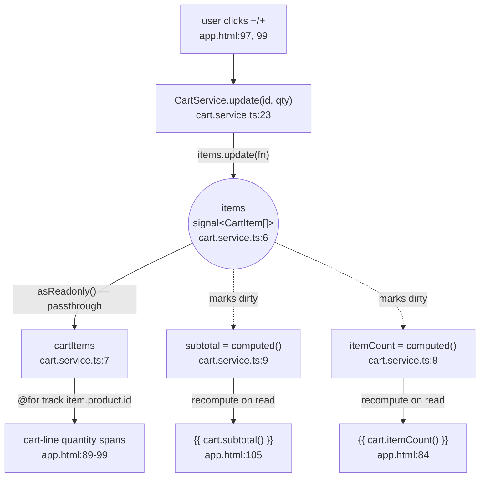

# marketday — mini product catalog

A small Angular 20 storefront (product grid + filtering/search + shopping bag) built entirely on **standalone components** and **Angular Signals**, with no NgModules, no NgRx, and no backend — `MOCK_PRODUCTS` is the only "API." This README documents the architecture the way you'd defend it in a system-design interview: what's here, why it's shaped this way, and where it would have to change to grow up.

## Quick facts

| | |
|---|---|
| Framework | Angular 20.3, standalone components (`bootstrapApplication`, no `NgModule`) |
| State management | Angular Signals (`signal` / `computed`) — no NgRx, no RxJS store, no `effect()` anywhere |
| Change detection | Zone.js, default strategy — **not** zoneless, **not** `OnPush` (see [Change detection](#change-detection-the-part-people-get-wrong)) |
| Components | One: `AppComponent`. No child components, no `@Input()`/`@Output()` in the codebase |
| Data source | `MOCK_PRODUCTS`, a static in-memory array — no `HttpClient`, no backend |
| Routing | `provideRouter([])` is configured but unused — no `<router-outlet>`, empty route table |
| Styling | Hand-rolled CSS custom properties (`--ink`, `--muted`, `--orange`, `--green`, `--paper`, `--line`), Playfair Display + DM Mono, default (emulated) view encapsulation |
| Tests | None — `ng test` is wired up in `package.json`, but no `.spec.ts` files exist |

## Project structure

```
UI/src/app/
├── app.ts             AppComponent — the entire app: catalog, filters, cart drawer, toast
├── app.html            single template for all of the above
├── app.css             single stylesheet, :host-scoped
├── app.config.ts        ApplicationConfig — provideRouter + provideAnimationsAsync
├── app.routes.ts        Routes = [] (scaffolded, unused)
├── cart.service.ts       CartService — the only other piece of state in the app
├── mock-data.ts         MOCK_PRODUCTS: Product[] — the "backend"
└── models.ts            Category, Product, CartItem
```

## Architecture

### Bootstrap

`main.ts` calls `bootstrapApplication(AppComponent, appConfig)` — there's no `AppModule` to assemble. `AppComponent` is `standalone: true` and lists its own dependencies (`CommonModule`, `FormsModule`) directly in `@Component.imports`. `app.config.ts` supplies two providers: `provideRouter(routes)` (routing infrastructure with an empty route table — not actually driving any navigation) and `provideAnimationsAsync()` (the async animations engine, unused by any `animations: [...]` trigger in this codebase — the CSS `@keyframes rise` transitions don't need it).

### Two owners of state, everything else is derived

This app has exactly **six writable signals** and everything else is a `computed()` view over them:

| Writable signal | Lives in | Holds |
|---|---|---|
| `searchTerm` | `AppComponent` | current search box text |
| `activeCategory` | `AppComponent` | selected filter tab |
| `isCartOpen` | `AppComponent` | is the drawer visually open |
| `showSuccess` | `AppComponent` | is the post-checkout toast visible |
| `items` (private) | `CartService` | the bag's contents — `CartItem[]` |

| Computed signal | Lives in | Derives from |
|---|---|---|
| `filteredProducts` | `AppComponent` | `searchTerm`, `activeCategory`, static `MOCK_PRODUCTS` |
| `cartItems` | `CartService` | `items` — via `.asReadonly()`, a passthrough, not a `computed()` |
| `itemCount` | `CartService` | `items` |
| `subtotal` | `CartService` | `items` |

The split is deliberate, not incidental: `CartService` is `@Injectable({ providedIn: 'root' })` — an app-wide singleton, independent of any component's position in the tree or lifecycle. That's the right home for **domain state that should outlive a view** (the bag shouldn't empty itself if a future route change unmounted the component that rendered it). `isCartOpen` and `showSuccess`, by contrast, are pure view state with no meaning outside this one screen, so they stay on `AppComponent` rather than polluting the service.

### The cart's signal graph



`update()` never pushes a new total anywhere — it mutates the one `items` signal. That write **marks** `subtotal`/`itemCount` dirty (dashed edges above); neither actually recomputes until the template next reads it (solid edges). `cartItems` isn't a `computed()` at all — `asReadonly()` just hands out the same array reference with the write methods stripped off, so it costs nothing beyond a wrapper object. Every write goes through `CartService.update()/add()/remove()`, which rebuild the array immutably (`.map()`/spread, never `item.quantity += 1` in place) — signals detect changes by reference, so an in-place mutation would leave `items()`'s reference untouched and no dependent would ever fire.

### Change detection — the part people get wrong

It's easy to assume "this app uses signals" implies fine-grained, zoneless rendering. It doesn't, fully:

- **Zone.js is present.** `zone.js` is a direct dependency and `app.config.ts` never calls `provideZonelessChangeDetection()`. Every DOM event Zone patches (a button click) still triggers Angular's ordinary change-detection cycle.
- **`AppComponent` has no `ChangeDetectionStrategy.OnPush`.** With the default strategy, a CD trigger re-checks every binding in the component's view — there's only one component here, so in practice that's "the whole app" on every click.
- **Signals still buy something, at a lower layer.** Since Angular 17+, a template expression that reads a signal compiles to an individually-tracked binding: Angular knows exactly which DOM text node / attribute depends on which signal, and only writes to the DOM where the value actually changed — independent of `OnPush` or zoneless. `computed()` also means `subtotal`'s `.reduce()` doesn't re-run on every pass, only when `items()` changed.

So: change detection itself is still coarse and zone-triggered; DOM writes and derived-value computation are fine-grained via signals regardless. Those are two different optimizations, and this app only has one of them.

### Template syntax

The template uses the newer block control flow (`@for`, `@if`/`@else`, `@empty`) instead of `*ngFor`/`*ngIf`. These are compiled directly by the template compiler, not `CommonModule` directives — `@for` also *requires* an explicit `track` expression (here, `track item.product.id` / `track product.id`), closing off the classic "forgot `trackBy`" bug class that `*ngFor` allowed. `CommonModule` is still imported in `app.ts` but nothing in `app.html` appears to need it (no `NgIf`/`NgFor`/pipes) — likely vestigial. `FormsModule` is needed for one thing: `[ngModel]` on the search input. Note it's `[ngModel]="searchTerm()"` + `(ngModelChange)="searchTerm.set($event)"`, not `[(ngModel)]="searchTerm"` — banana-in-a-box needs a plain assignable property, and a `WritableSignal` is a function, so the two-way binding is decomposed by hand.

### What's mocked, and what breaks first at scale

- **No backend.** `MOCK_PRODUCTS` is a static array; there's no `HttpClient` call anywhere in the app.
- **No persistence.** Refreshing the page empties the bag — nothing writes `items()` to storage.
- **No stock re-validation.** `add()`/`update()` clamp quantity to `product.stock` client-side (`cart.service.ts:16,29`), but that number is whatever was true when the page loaded — nothing re-checks it before "checkout."
- **Checkout is a stub.** `checkout()` sets `showSuccess(true)` and calls `cart.clear()` — no request is sent; the toast copy says as much ("Your mock order is ready for the API").
- **Routing is scaffolded, not wired.** `provideRouter([])` exists; nothing in the template uses `routerLink` or `<router-outlet>`. The "Our story" nav link is a same-page `#story` anchor.
- **No tests.** `ng test` is configured but there are zero `.spec.ts` files — `CartService`'s clamping/removal logic in particular is pure and signal-driven, so it's cheap to unit test without `TestBed` rendering (call `.update()`, assert `.subtotal()`).

## Running it

```bash
npm start   # ng serve
npm run build
npm test    # ng test --watch=false --browsers=ChromeHeadless (no specs exist yet)
```

---

## 50 interview questions & answers

### Standalone components & bootstrap

**1. This app has no `AppModule`. How does it bootstrap?**
`main.ts` calls `bootstrapApplication(AppComponent, appConfig)` instead of `platformBrowserDynamic().bootstrapModule(AppModule)`. `AppComponent` is `standalone: true` and declares its own imports (`[CommonModule, FormsModule]`) directly in the `@Component` decorator, so there's no `NgModule` tree to assemble at all.

**2. What does `appConfig` (`app.config.ts`) provide, and is all of it used?**
`provideRouter(routes)` and `provideAnimationsAsync()`. `provideRouter` is wired up but `routes` (`app.routes.ts`) is an empty array and the template has no `<router-outlet>` — routing is scaffolded, not used.

**3. Why is `provideAnimationsAsync()` included when nothing uses the `animations: [...]` trigger API?**
The CSS `@keyframes rise` transitions in `app.css` are pure CSS and don't need it. It's likely pre-wired for a future feature (drawer enter/exit transitions) or a starter-template leftover — an extra bundle chunk with no current payoff, worth flagging in review.

**4. Why import `CommonModule` when the template uses `@if`/`@for` instead of `*ngIf`/`*ngFor`?**
The new block syntax is built into the template compiler, not backed by `CommonModule` directives. Scanning `app.html`, no `NgFor`/`NgIf`/pipe from `CommonModule` actually appears — the import looks vestigial.

**5. Why is `FormsModule` needed here?**
For `[ngModel]` on the search input (`app.html:32-33`), which needs `FormsModule`'s `NgModel` directive to bind and read the input's value.

**6. What's the component tree?**
One component: `AppComponent`. No child components, no `@Input()`/`@Output()` boundary exists anywhere in the app.

### Signals fundamentals

**7. What is a signal, mechanically?**
A reactive value wrapper: `signal(initial)` returns a `WritableSignal` — a zero-arg function you call to read the current value (registering as a dependency if read inside a reactive context), with `.set()`/`.update()` to write a new value and synchronously notify dependents.

**8. Difference between `.set()` and `.update()`?**
`.set(v)` replaces the value outright (`items.set([])` in `clear()`). `.update(fn)` passes the current value to `fn` and stores the return — used whenever the new state derives from the old, e.g. `items.update(items => items.map(...))` in `update()`.

**9. What does `computed()` add over just calling a function?**
`computed(fn)` is lazy and memoized: it only re-runs `fn` when a signal it previously read has actually changed, and caches the result between reads. A plain method re-runs its full body on every call, no matter what.

**10. Why is `subtotal` a `computed()` instead of a plain `computeSubtotal()` method?**
The template reads it on every change-detection pass (`app.html:105`). As a `computed()`, repeated reads across CD cycles are free until `items()` changes; as a method, it would re-run `.reduce()` on every single check.

**11. How does Angular know a computed is dirty without re-running it?**
Each signal has a version counter. Reading a signal inside a `computed()`/`effect()` registers it as a dependency. A write bumps the writable signal's version and walks the dependency graph marking dependents dirty — a graph walk, not a re-execution. The expensive function body only runs the next time something *reads* the dirty computed.

**12. Can you write to a computed signal?**
No — `computed()` returns a read-only `Signal<T>`, no `.set()`/`.update()`. The only writable signal touching cart state is the private `items`; `subtotal`, `itemCount`, and `cartItems` are all read-only views over it.

**13. Why is `items` `private readonly` and exposed as `cartItems = items.asReadonly()`?**
Encapsulation — outside code shouldn't be able to call `items.set(...)` and bypass the stock-clamping/removal logic in `add()`/`update()`/`remove()`. `.asReadonly()` gives the same live value with the write methods stripped off.

**14. No `effect()` appears anywhere. When would you reach for one instead of `computed()`?**
`computed()` is for deriving a pure value you read elsewhere (lazy, no side effects). `effect()` is for a side effect that should run automatically when its dependencies change — logging, syncing to `localStorage`, imperative DOM/third-party-widget updates. Nothing here needs a side effect beyond what template bindings already do, hence zero `effect()` calls.

### This app's state architecture

**15. How many independent writable signals exist, and where do they live?**
Six: `searchTerm`, `activeCategory`, `isCartOpen`, `showSuccess` on `AppComponent`; `items` in `CartService`. Everything else is derived.

**16. Why does cart state live in a separate `CartService` instead of directly on `AppComponent`?**
`CartService` is `@Injectable({ providedIn: 'root' })` — an app-wide singleton independent of any component's lifecycle. If the app grew a second route (e.g. `/checkout`), the cart would survive navigating away from the catalog, because it isn't owned by the component that would get destroyed.

**17. Walk through what happens end-to-end when a user clicks “+” on a cart line.**
Click calls `cart.update(item.product.id, item.quantity + 1)` (`app.html:99`) → `CartService.update()` clamps to `product.stock` and calls `this.items.update(...)` with a new mapped array (`cart.service.ts:28-30`) → that write marks `subtotal`/`itemCount` dirty and produces a new array reference `asReadonly()` exposes unchanged → the template's `{{ item.quantity }}`, `{{ cart.subtotal() }}`, `{{ cart.itemCount() }}` bindings pick up the new values and Angular updates just those DOM text nodes.

**18. What happens on `cart.update(id, 0)`?**
`update()` checks `quantity < 1` and delegates to `remove(productId)` (`cart.service.ts:24-27`) instead of writing an invalid quantity — decrementing from 1 removes the line rather than leaving a broken zero-quantity row.

**19. How is overselling prevented?**
`add()` and `update()` both clamp with `Math.min(quantity, product.stock)` (`cart.service.ts:16, 29`). There's no server round-trip re-validating stock — it's a purely client-side guard against a static mock dataset.

**20. Why is `filteredProducts` a `computed()` but `MOCK_PRODUCTS` just a plain constant, not a signal?**
`MOCK_PRODUCTS` never changes at runtime, so wrapping it in a signal would add tracking overhead for a value with nothing to track. `filteredProducts` only needs to react to `searchTerm`/`activeCategory`; the plain array is just captured in the closure.

**21. The search predicate does `` `${name} ${description} ${category}`.toLowerCase().includes(term) `` per product. What's the risk at scale?**
It's an O(n) string build + scan on every keystroke, not debounced or indexed — fine for 6 mock products, but a real catalog would want a debounced input and indexed/server-side search rather than rebuilding a fresh string per product per render.

**22. Why does `isCartOpen` live on `AppComponent` rather than `CartService`?**
It's view state (is a panel visually open), not domain data (what's in the bag). Domain state belongs in the service; ephemeral, screen-local view state belongs on the component — otherwise `CartService` becomes harder to reuse anywhere that doesn't have this exact drawer.

**23. `checkout()` calls `cart.clear()` and sets `showSuccess(true)`. What's missing, and why does it matter?**
No HTTP call, no order payload, no error path — the toast text admits it. In a real flow, `clear()` should only run after a successful server response, with the cart left intact (plus a loading/error state) if checkout fails, since `clear()` here is instantaneous and irreversible.

**24. `categories` is hand-typed in `app.ts` and duplicates the `Category` union in `models.ts`. What's the risk?**
TypeScript types are erased at runtime — nothing keeps the array and the union in sync. Adding a category to `Product` without updating this array leaves products with no filter tab (or a stale tab with nothing in it).

### Change detection & rendering

**25. Is this app zoneless?**
No — `zone.js` is a direct dependency and `app.config.ts` never calls `provideZonelessChangeDetection()`. Zone.js still patches events/timers/promises and drives Angular's change detection.

**26. `AppComponent` has no `ChangeDetectionStrategy.OnPush`. What does that mean for a click?**
A Zone-patched DOM event still runs Angular's default-strategy CD, which re-checks every binding in the view on every trigger — not just bindings whose signals changed. There's one component here, so "the whole tree" is just this one view, but the mechanism is still coarse, zone-triggered CD, not signal-driven skipping.

**27. Given #26, do signals still buy anything?**
Yes, at a different layer: since Angular 17+, a template expression reading a signal compiles to an individually tracked binding, so Angular knows exactly which DOM instruction depends on which signal and only writes where the value changed — independent of `OnPush`/zoneless. `computed()` also skips re-running `subtotal`'s `.reduce()` when `items()` hasn't changed. CD still runs on every click; DOM writes and derivation are still fine-grained.

**28. Why does `@for` at `app.html:89` use `track item.product.id` instead of `track $index`?**
`track` tells Angular which DOM node maps to which array element across renders. `product.id` lets Angular reuse/reorder existing `.cart-line` elements instead of destroying and recreating them every time `items.update()` produces a new array reference; `$index` would misattribute nodes if order or contents shift. Unlike legacy `*ngFor`, the new `@for` block requires an explicit `track` expression.

**29. If the cart drawer is closed, does `subtotal` still recompute on every `items` change?**
No — `computed()` is lazy. A write to `items` marks `subtotal` dirty, but the derivation doesn't run until something reads `subtotal()` again.

**30. The topbar bag icon (`app.html:9`) reads `cart.itemCount()` and is always rendered. How does that interact with #29?**
Because it's an always-live reader, `itemCount()` gets read on essentially every CD pass, so in practice it recomputes right after any cart mutation regardless of whether the drawer is open — the laziness of `computed()` here is more about correctness than actual deferred work, since there's always at least one live reader.

### Template syntax & control flow

**31. What's the difference between `@for`/`@if` and `*ngFor`/`*ngIf`?**
The new blocks are parsed and compiled directly by the template compiler as first-class syntax, not `CommonModule` directives — no imports needed, built-in `@else`/`@empty` branches, and `@for` enforces an explicit `track` at compile time.

**32. What does `@empty` do at `app.html:61-66`?**
It renders when `filteredProducts()` has zero items — the "No pieces found" empty state — replacing the old pattern of a hand-synced sibling `*ngIf="length === 0"` block.

**33. Why `[ngModel]="searchTerm()"` + `(ngModelChange)="searchTerm.set($event)"` instead of `[(ngModel)]="searchTerm"`?**
`[(ngModel)]="searchTerm"` would try to assign back to `searchTerm` as a plain property (`searchTerm = $event`), but `searchTerm` is a `WritableSignal` — a function, not an assignable variable — so the two-way binding has to be decomposed by hand into a read and an explicit `.set()`.

**34. `[style.background]="product.color"` appears repeatedly. Is that a structural directive?**
No — it's a built-in style binding. The compiler has native instructions for `[style.*]`/`[class.*]`; no `NgStyle`/`NgClass` import is required for these single-property forms.

**35. Why `[attr.aria-selected]="..."` instead of a plain property binding (`app.html:26`)?**
`aria-selected` has no corresponding JS property on the element and needs the literal string `"true"`/`"false"` for assistive tech. `[attr.x]` binds to the HTML attribute directly (and removes it on `null`/`undefined`); a plain `[x]` binding targets a same-named JS property that doesn't exist here.

### Component / service design decisions

**36. This is one component. When would you split it into `ProductCardComponent`, `CartDrawerComponent`, etc.?**
When any of: a piece of UI needs reuse elsewhere; the template/class is too large to review as one unit (`app.html` is already ~125 dense lines); or you want an isolated `OnPush` change-detection boundary around an expensive part so a drawer-only interaction doesn't re-check the whole catalog. None of those pressures exist yet at 6 mock products.

**37. If you split out `CartDrawerComponent`, how does it get cart state — `@Input()` or injecting `CartService`?**
Inject `CartService` directly. Because it's `providedIn: 'root'`, a child component gets the same singleton without `AppComponent` threading `cart`/`cart.subtotal()` through `@Input()` bindings.

**38. Why a service over lifting cart state into a shared signal on `AppComponent` and passing it down?**
A service is DI-resolved, not tied to a component's tree position — any future component, route, or guard can inject it. A signal on `AppComponent` only reaches descendants via explicit `@Input()` wiring, which doesn't scale past one level.

**39. `add()` rebuilds the array with `.map()`/spread instead of mutating the found item's `quantity` in place. Why?**
Signals detect changes by reference/version, not deep equality. `item.quantity += 1` in place would leave the `items` array's reference unchanged, so the signal would never mark itself dirty and nothing downstream would update — immutability isn't a style choice here, it's required for the signal to fire.

**40. `formatPrice()` is a plain method called in the template. What's the general concern with template method calls, and does it apply here?**
Template method calls re-run on every CD pass with no memoization — a classic Angular perf footgun for expensive methods. Here it's one cheap string interpolation, a non-issue at this scale; at real scale you'd promote it to a pure `Pipe`, which Angular does memoize.

**41. What test coverage exists?**
None — `ng test` is configured but there are no `.spec.ts` files. `CartService`'s clamping/removal logic and `filteredProducts`'s predicate are pure and signal-driven, so they're cheap to unit test without `TestBed` rendering (call `.update()`, assert `.subtotal()` directly) — and neither has coverage today.

### Data modeling & TypeScript

**42. `Category` includes `'All'`, but `Product.category` is typed `Exclude<Category, 'All'>`. Why the split?**
`'All'` is a valid filter-UI state (`activeCategory`) but never a valid value for an actual product. `Exclude<Category, 'All'>` reuses the same union without redeclaring the four real category names, and stops a `Product` literal from ever being typed `category: 'All'` by mistake.

**43. `CartItem` stores the whole `Product` object, not just a `productId`. Why, and what's the risk?**
`MOCK_PRODUCTS` is static, so it's a fair trade here — simpler template code (`item.product.name` directly, no lookup). It stops being safe once products come from a server and can change: a cart line would silently render a stale price/stock snapshotted at add-to-cart time instead of the current value.

**44. `badge?: string` is optional. How does the template guard against `undefined`?**
`@if (product.badge) { <span class="badge">{{ product.badge }}</span> }` (`app.html:44`) — only renders when truthy, so an absent badge renders nothing rather than the literal text "undefined".

### Production readiness & scaling

**45. Wired to a real backend, what changes about `CartService`'s shape?**
`add()`/`update()`/`remove()` become async (HTTP), so `items` likely needs companion loading/error state (or modeling as Angular's `resource()` primitive for signal-driven async data), and stock clamping needs server-side re-validation since a cached `product.stock` can go stale before checkout.

**46. Minimal change to swap `MOCK_PRODUCTS` for a real API without touching the template?**
Replace the static `products = MOCK_PRODUCTS` with a `resource()`/signal populated from an injected `HttpClient` call — `filteredProducts`'s `computed()` body doesn't care where `products` came from, only that reading it is synchronous by the time it's read.

**47. No persistence — refresh empties the cart. Lowest-effort fix with what's already here?**
An `effect()` in `CartService` that writes `items()` to `localStorage` on every change, plus seeding the initial `signal()` call from storage at construction — exactly the "sync a signal to the outside world" use case `effect()` exists for, and one this app currently has zero of.

**48. Is the `#story` nav link and "active" `Shop` tab real routing?**
No — `#story` is an in-page anchor scroll to `id="story"`, and "active" is a hardcoded CSS class, not `RouterLink`/`RouterLinkActive`. `provideRouter` is configured but unused (see Q2).

**49. Adding a real `/checkout` route — what breaks in the current design?**
`isCartOpen` and `showSuccess` can't stay `AppComponent`-local signals if a route change unmounts the component that owns them. `checkout()` itself would need to live somewhere route-independent — most naturally `CartService` or a new `CheckoutService` — so state and behavior survive navigating catalog → checkout → (on failure) back.

**50. Is this single-file, single-component structure a mistake?**
Not for what it is — a small, self-contained mock catalog; it's an honest architecture for its actual scope. It becomes a liability specifically past the pressures in Q36 (reuse, review size, isolated CD boundaries). The interview-worthy point isn't "components are always better" — it's recognizing which of those pressures you're actually under before reaching for the split.
