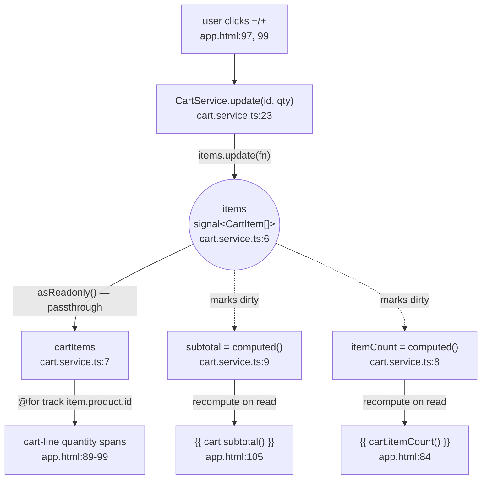

# marketday — mini product catalog

A small Angular 20 storefront (product grid + filtering/search + shopping bag) built entirely on **standalone components** and **Angular Signals**, with no NgModules, no NgRx, and no backend — `MOCK_PRODUCTS` is the only "API." This README documents the architecture the way you'd defend it in a system-design interview: what's here, why it's shaped this way, and where it would have to change to grow up.

## Quick facts

| | |
|---|---|
| Framework | Angular 20.3, standalone components (`bootstrapApplication`, no `NgModule`) |
| State management | Angular Signals (`signal` / `computed`) — no NgRx, no RxJS store, no `effect()` anywhere |
| Change detection | Zone.js, default strategy — **not** zoneless, **not** `OnPush` (see [Change detection](#change-detection-the-part-people-get-wrong)) |
| Components | One: `AppComponent`. No child components, no `@Input()`/`@Output()` in the codebase |
| Data source | `MOCK_PRODUCTS`, a static in-memory array — no `HttpClient`, no backend |
| Routing | `provideRouter([])` is configured but unused — no `<router-outlet>`, empty route table |
| Styling | Hand-rolled CSS custom properties (`--ink`, `--muted`, `--orange`, `--green`, `--paper`, `--line`), Playfair Display + DM Mono, default (emulated) view encapsulation |
| Tests | None — `ng test` is wired up in `package.json`, but no `.spec.ts` files exist |

## Project structure

```
UI/src/app/
├── app.ts             AppComponent — the entire app: catalog, filters, cart drawer, toast
├── app.html            single template for all of the above
├── app.css             single stylesheet, :host-scoped
├── app.config.ts        ApplicationConfig — provideRouter + provideAnimationsAsync
├── app.routes.ts        Routes = [] (scaffolded, unused)
├── cart.service.ts       CartService — the only other piece of state in the app
├── mock-data.ts         MOCK_PRODUCTS: Product[] — the "backend"
└── models.ts            Category, Product, CartItem
```

## Architecture

### Bootstrap

`main.ts` calls `bootstrapApplication(AppComponent, appConfig)` — there's no `AppModule` to assemble. `AppComponent` is `standalone: true` and lists its own dependencies (`CommonModule`, `FormsModule`) directly in `@Component.imports`. `app.config.ts` supplies two providers: `provideRouter(routes)` (routing infrastructure with an empty route table — not actually driving any navigation) and `provideAnimationsAsync()` (the async animations engine, unused by any `animations: [...]` trigger in this codebase — the CSS `@keyframes rise` transitions don't need it).

### Two owners of state, everything else is derived

This app has exactly **six writable signals** and everything else is a `computed()` view over them:

| Writable signal | Lives in | Holds |
|---|---|---|
| `searchTerm` | `AppComponent` | current search box text |
| `activeCategory` | `AppComponent` | selected filter tab |
| `isCartOpen` | `AppComponent` | is the drawer visually open |
| `showSuccess` | `AppComponent` | is the post-checkout toast visible |
| `items` (private) | `CartService` | the bag's contents — `CartItem[]` |

| Computed signal | Lives in | Derives from |
|---|---|---|
| `filteredProducts` | `AppComponent` | `searchTerm`, `activeCategory`, static `MOCK_PRODUCTS` |
| `cartItems` | `CartService` | `items` — via `.asReadonly()`, a passthrough, not a `computed()` |
| `itemCount` | `CartService` | `items` |
| `subtotal` | `CartService` | `items` |

The split is deliberate, not incidental: `CartService` is `@Injectable({ providedIn: 'root' })` — an app-wide singleton, independent of any component's position in the tree or lifecycle. That's the right home for **domain state that should outlive a view** (the bag shouldn't empty itself if a future route change unmounted the component that rendered it). `isCartOpen` and `showSuccess`, by contrast, are pure view state with no meaning outside this one screen, so they stay on `AppComponent` rather than polluting the service.

### The cart's signal graph



`update()` never pushes a new total anywhere — it mutates the one `items` signal. That write **marks** `subtotal`/`itemCount` dirty (dashed edges above); neither actually recomputes until the template next reads it (solid edges). `cartItems` isn't a `computed()` at all — `asReadonly()` just hands out the same array reference with the write methods stripped off, so it costs nothing beyond a wrapper object. Every write goes through `CartService.update()/add()/remove()`, which rebuild the array immutably (`.map()`/spread, never `item.quantity += 1` in place) — signals detect changes by reference, so an in-place mutation would leave `items()`'s reference untouched and no dependent would ever fire.

### Change detection — the part people get wrong

It's easy to assume "this app uses signals" implies fine-grained, zoneless rendering. It doesn't, fully:

- **Zone.js is present.** `zone.js` is a direct dependency and `app.config.ts` never calls `provideZonelessChangeDetection()`. Every DOM event Zone patches (a button click) still triggers Angular's ordinary change-detection cycle.
- **`AppComponent` has no `ChangeDetectionStrategy.OnPush`.** With the default strategy, a CD trigger re-checks every binding in the component's view — there's only one component here, so in practice that's "the whole app" on every click.
- **Signals still buy something, at a lower layer.** Since Angular 17+, a template expression that reads a signal compiles to an individually-tracked binding: Angular knows exactly which DOM text node / attribute depends on which signal, and only writes to the DOM where the value actually changed — independent of `OnPush` or zoneless. `computed()` also means `subtotal`'s `.reduce()` doesn't re-run on every pass, only when `items()` changed.

So: change detection itself is still coarse and zone-triggered; DOM writes and derived-value computation are fine-grained via signals regardless. Those are two different optimizations, and this app only has one of them.

### Template syntax

The template uses the newer block control flow (`@for`, `@if`/`@else`, `@empty`) instead of `*ngFor`/`*ngIf`. These are compiled directly by the template compiler, not `CommonModule` directives — `@for` also *requires* an explicit `track` expression (here, `track item.product.id` / `track product.id`), closing off the classic "forgot `trackBy`" bug class that `*ngFor` allowed. `CommonModule` is still imported in `app.ts` but nothing in `app.html` appears to need it (no `NgIf`/`NgFor`/pipes) — likely vestigial. `FormsModule` is needed for one thing: `[ngModel]` on the search input. Note it's `[ngModel]="searchTerm()"` + `(ngModelChange)="searchTerm.set($event)"`, not `[(ngModel)]="searchTerm"` — banana-in-a-box needs a plain assignable property, and a `WritableSignal` is a function, so the two-way binding is decomposed by hand.

### What's mocked, and what breaks first at scale

- **No backend.** `MOCK_PRODUCTS` is a static array; there's no `HttpClient` call anywhere in the app.
- **No persistence.** Refreshing the page empties the bag — nothing writes `items()` to storage.
- **No stock re-validation.** `add()`/`update()` clamp quantity to `product.stock` client-side (`cart.service.ts:16,29`), but that number is whatever was true when the page loaded — nothing re-checks it before "checkout."
- **Checkout is a stub.** `checkout()` sets `showSuccess(true)` and calls `cart.clear()` — no request is sent; the toast copy says as much ("Your mock order is ready for the API").
- **Routing is scaffolded, not wired.** `provideRouter([])` exists; nothing in the template uses `routerLink` or `<router-outlet>`. The "Our story" nav link is a same-page `#story` anchor.
- **No tests.** `ng test` is configured but there are zero `.spec.ts` files — `CartService`'s clamping/removal logic in particular is pure and signal-driven, so it's cheap to unit test without `TestBed` rendering (call `.update()`, assert `.subtotal()`).

## Running it

```bash
npm start   # ng serve
npm run build
npm test    # ng test --watch=false --browsers=ChromeHeadless (no specs exist yet)
```

---

## 50 interview questions & answers

### Standalone components & bootstrap

**1. This app has no `AppModule`. How does it bootstrap?**
`main.ts` calls `bootstrapApplication(AppComponent, appConfig)` instead of `platformBrowserDynamic().bootstrapModule(AppModule)`. `AppComponent` is `standalone: true` and declares its own imports (`[CommonModule, FormsModule]`) directly in the `@Component` decorator, so there's no `NgModule` tree to assemble at all. Mechanically, `bootstrapApplication` skips the whole `NgModule` compilation/injector-hierarchy step: instead of Angular building a module graph (`AppModule` → its `imports`/`declarations` → a root injector derived from `providers`), it creates a single root environment injector directly from `appConfig.providers` and renders `AppComponent` into it. That's also why standalone apps tend to tree-shake better — there's no module boundary forcing everything a module declares to load together, so an unused standalone component that's never imported anywhere is never pulled into the bundle at all.

**2. What does `appConfig` (`app.config.ts`) provide, and is all of it used?**
`provideRouter(routes)` and `provideAnimationsAsync()`. `provideRouter` is wired up but `routes` (`app.routes.ts`) is an empty array and the template has no `<router-outlet>` — routing is scaffolded, not used. Both are function-style providers (the standalone-era replacement for `imports: [RouterModule.forRoot(...)]`/`BrowserAnimationsModule`): each returns an array of `Provider` objects that get flattened into `appConfig.providers` and registered on the root injector, so — unlike an `NgModule` import — there's no implicit re-export of directives/components riding along, just DI registrations. If a third provider were needed (say `provideHttpClient()`), it would be added to this same array; there's no separate "imports" vs. "providers" distinction to reconcile the way there was with modules.

**3. Why is `provideAnimationsAsync()` included when nothing uses the `animations: [...]` trigger API?**
The CSS `@keyframes rise` transitions in `app.css` are pure CSS and don't need it. It's likely pre-wired for a future feature (drawer enter/exit transitions) or a starter-template leftover — an extra bundle chunk with no current payoff, worth flagging in review. Concretely, `provideAnimationsAsync()` registers Angular's `AnimationEngine`/renderer factory and lazy-loads the `@angular/animations` runtime on first use — it's the "async" variant specifically so that chunk isn't in the initial bundle, but the DI registration itself (a handful of providers) still ships eagerly. The cheap fix, if this is confirmed dead weight, is either removing it until an `animations: [...]` trigger is actually written, or swapping to `provideNoopAnimations()` if some other library in the dependency tree expects the animation *module* to be present but no real animations are wanted yet.

**4. Why import `CommonModule` when the template uses `@if`/`@for` instead of `*ngIf`/`*ngFor`?**
The new block syntax is built into the template compiler, not backed by `CommonModule` directives. Scanning `app.html`, no `NgFor`/`NgIf`/pipe from `CommonModule` actually appears — the import looks vestigial. `ng lint`/a strict unused-imports check would flag this; removing it should be a no-op build, and doing so is the kind of small cleanup worth doing before this component gets copy-pasted as a starting point for a new screen — otherwise the habit of "always import `CommonModule`" propagates even after `@if`/`@for` made it optional for most templates.

**5. Why is `FormsModule` needed here?**
For `[ngModel]` on the search input (`app.html:32-33`), which needs `FormsModule`'s `NgModel` directive to bind and read the input's value. Unlike `CommonModule` in Q4, this one earns its keep: `NgModel` is a genuine structural directive (it hooks the `input`/`change` DOM events and pushes/pulls the control's value), not something the template compiler has a built-in instruction for. The alternative would be Angular's reactive forms (`ReactiveFormsModule` + `FormControl`), which trades this one `[ngModel]` binding for more explicit, more testable form state — arguably a better fit once there's more than a single search box, since reactive forms compose validators and value-change streams without template-driven `(ngModelChange)` wiring.

**6. What's the component tree?**
One component: `AppComponent`. No child components, no `@Input()`/`@Output()` boundary exists anywhere in the app. That also means there's exactly one Angular injector in play for the whole UI (the root environment injector `bootstrapApplication` creates) — no component-level providers, no `@Injectable()` scoped narrower than root, and no `ViewChild`/content-projection concerns, since all of those only become meaningful once there's more than one node in the tree.

### Signals fundamentals

**7. What is a signal, mechanically?**
A reactive value wrapper: `signal(initial)` returns a `WritableSignal` — a zero-arg function you call to read the current value (registering as a dependency if read inside a reactive context), with `.set()`/`.update()` to write a new value and synchronously notify dependents. Calling it *outside* a reactive context (e.g. inside a plain `if` in TypeScript, not a template binding or `computed`/`effect`) is just a value read — no dependency gets registered, because there's no consumer for it to register with. That "is anyone listening" distinction is why the same `searchTerm()` call behaves differently depending on where it appears: read inside `filteredProducts`'s `computed()` body, it wires up tracking; read once in a `console.log`, it's inert.

**8. Difference between `.set()` and `.update()`?**
`.set(v)` replaces the value outright (`items.set([])` in `clear()`). `.update(fn)` passes the current value to `fn` and stores the return — used whenever the new state derives from the old, e.g. `items.update(items => items.map(...))` in `update()`. There's a third, rarer method, `.mutate()`, on some signal APIs — deliberately absent from this codebase's usage, and for good reason (see Q39): it would let you reach into the current value and mutate it in place, which defeats the reference-equality change detection signals rely on. `.set()`/`.update()` both force a fresh reference, which is exactly the property `.mutate()` would throw away.

**9. What does `computed()` add over just calling a function?**
`computed(fn)` is lazy and memoized: it only re-runs `fn` when a signal it previously read has actually changed, and caches the result between reads. A plain method re-runs its full body on every call, no matter what. The laziness matters twice over: it's lazy about *when* (doesn't run at declaration time or on unrelated writes, only on the next read after a dependency changed) and lazy about *whether* (if nothing ever reads it again, it simply never recomputes, no matter how many times its dependencies change in the meantime).

**10. Why is `subtotal` a `computed()` instead of a plain `computeSubtotal()` method?**
The template reads it on every change-detection pass (`app.html:105`). As a `computed()`, repeated reads across CD cycles are free until `items()` changes; as a method, it would re-run `.reduce()` on every single check. At 6 mock products the `.reduce()` cost is negligible either way — the pattern matters more as a habit than as a measured win here, but it's the difference between an app whose per-click cost scales with catalog size and one whose per-click cost scales with how much of the *cart* actually changed.

**11. How does Angular know a computed is dirty without re-running it?**
Each signal has a version counter. Reading a signal inside a `computed()`/`effect()` registers it as a dependency. A write bumps the writable signal's version and walks the dependency graph marking dependents dirty — a graph walk, not a re-execution. The expensive function body only runs the next time something *reads* the dirty computed. This is also why a `computed()` can have dependencies that change between runs: if `fn`'s first branch reads signal `a` and its second branch reads signal `b`, only the signals actually touched on the *last* run are tracked — the dependency graph is rebuilt on every recomputation, not fixed at first declaration, so a computed that takes different branches over time automatically starts/stops listening to the signals each branch happens to read.

**12. Can you write to a computed signal?**
No — `computed()` returns a read-only `Signal<T>`, no `.set()`/`.update()`. The only writable signal touching cart state is the private `items`; `subtotal`, `itemCount`, and `cartItems` are all read-only views over it. This one-way flow (writable → computed → template) is deliberate: it rules out the classic "who mutated this and when" debugging problem you get with mutable shared state, because there is exactly one place (`CartService`'s methods) anything can originate a change from.

**13. Why is `items` `private readonly` and exposed as `cartItems = items.asReadonly()`?**
Encapsulation — outside code shouldn't be able to call `items.set(...)` and bypass the stock-clamping/removal logic in `add()`/`update()`/`remove()`. `.asReadonly()` gives the same live value with the write methods stripped off. It's worth contrasting this with the `computed()`-based readonly signals (`subtotal`, `itemCount`): `.asReadonly()` on `items` is a type-level restriction only — the underlying value object is the exact same one `items` holds, just re-exposed through a narrower TypeScript type, so it costs nothing at runtime beyond wrapping the getter. A `computed()`, by contrast, does real work — it evaluates `fn` and caches a *derived* value distinct from any writable signal.

**14. No `effect()` appears anywhere. When would you reach for one instead of `computed()`?**
`computed()` is for deriving a pure value you read elsewhere (lazy, no side effects). `effect()` is for a side effect that should run automatically when its dependencies change — logging, syncing to `localStorage`, imperative DOM/third-party-widget updates. Nothing here needs a side effect beyond what template bindings already do, hence zero `effect()` calls. Q47's `localStorage` persistence idea is the concrete example of when this codebase would first need one: `effect(() => localStorage.setItem('cart', JSON.stringify(this.items())))` registered in `CartService`'s constructor, which is also the one place `effect()` is normally allowed to run outside an injection context without an explicit `{ injector }` option, since a service constructor already runs inside one.

### This app's state architecture

**15. How many independent writable signals exist, and where do they live?**
Six: `searchTerm`, `activeCategory`, `isCartOpen`, `showSuccess` on `AppComponent`; `items` in `CartService`. Everything else is derived. (Note the header count and the enumeration both land on the same handful — the discipline worth calling out in review is that there are exactly as many writable signals as there are genuinely independent facts about the app's state; nothing here is a writable signal that could have been a `computed()` instead, which is the more common mistake in signal-based codebases as they grow.)

**16. Why does cart state live in a separate `CartService` instead of directly on `AppComponent`?**
`CartService` is `@Injectable({ providedIn: 'root' })` — an app-wide singleton independent of any component's lifecycle. If the app grew a second route (e.g. `/checkout`), the cart would survive navigating away from the catalog, because it isn't owned by the component that would get destroyed. `providedIn: 'root'` also means there's exactly one instance for the whole app (unlike a component-level `providers: [CartService]`, which would create a fresh instance per component instance) — that singleton-ness is what makes "inject it from anywhere and get the same bag" true rather than incidental.

**17. Walk through what happens end-to-end when a user clicks “+” on a cart line.**
Click calls `cart.update(item.product.id, item.quantity + 1)` (`app.html:99`) → `CartService.update()` clamps to `product.stock` and calls `this.items.update(...)` with a new mapped array (`cart.service.ts:28-30`) → that write marks `subtotal`/`itemCount` dirty and produces a new array reference `asReadonly()` exposes unchanged → the template's `{{ item.quantity }}`, `{{ cart.subtotal() }}`, `{{ cart.itemCount() }}` bindings pick up the new values and Angular updates just those DOM text nodes. One subtlety worth naming: the click handler itself is a Zone-patched DOM event, so it *also* kicks off a normal Angular change-detection pass across the whole component (see Q26) — the signal graph's fine-grained dirty-marking and the zone-triggered CD pass are two separate mechanisms running back-to-back on the same click, not one replacing the other.

**18. What happens on `cart.update(id, 0)`?**
`update()` checks `quantity < 1` and delegates to `remove(productId)` (`cart.service.ts:24-27`) instead of writing an invalid quantity — decrementing from 1 removes the line rather than leaving a broken zero-quantity row. It's also the only path by which a line disappears from the drawer via the quantity stepper (as opposed to a dedicated "remove" button, if one existed) — worth checking in review that the UI doesn't rely on a separate explicit-delete affordance that this same threshold silently duplicates or conflicts with.

**19. How is overselling prevented?**
`add()` and `update()` both clamp with `Math.min(quantity, product.stock)` (`cart.service.ts:16, 29`). There's no server round-trip re-validating stock — it's a purely client-side guard against a static mock dataset. Because `product.stock` is a snapshot embedded in `CartItem` at add-to-cart time (see Q43), this clamp is also only ever checked against a number that was true when the page loaded, not one re-fetched on each click — so in a multi-tab or multi-user scenario, two browser tabs could each independently believe there's stock for the same last unit, and both let the user "add" it, since neither ever asks a server that would know the other tab already claimed it.

**20. Why is `filteredProducts` a `computed()` but `MOCK_PRODUCTS` just a plain constant, not a signal?**
`MOCK_PRODUCTS` never changes at runtime, so wrapping it in a signal would add tracking overhead for a value with nothing to track. `filteredProducts` only needs to react to `searchTerm`/`activeCategory`; the plain array is just captured in the closure. This is a useful general rule: wrap something in `signal()` only when it can actually *change* over the component's lifetime — a value that's fixed at module-load time (a constant array, an injected config object, an enum) gains nothing from signal-wrapping and just adds a layer of indirection a reader has to see through.

**21. The search predicate does `` `${name} ${description} ${category}`.toLowerCase().includes(term) `` per product. What's the risk at scale?**
It's an O(n) string build + scan on every keystroke, not debounced or indexed — fine for 6 mock products, but a real catalog would want a debounced input and indexed/server-side search rather than rebuilding a fresh string per product per render. Two separate costs are bundled here worth pulling apart: the *string concatenation* happens fresh per product per keystroke (cheap to fix — precompute a lowercase searchable string once per product at load time, not per keystroke), while the *lack of debounce* means a fast typist can trigger a full re-filter of the whole catalog on every single keypress, which is the more consequential fix once `filteredProducts` starts driving a real (debounced, server-backed) search call rather than an in-memory `.includes()`.

**22. Why does `isCartOpen` live on `AppComponent` rather than `CartService`?**
It's view state (is a panel visually open), not domain data (what's in the bag). Domain state belongs in the service; ephemeral, screen-local view state belongs on the component — otherwise `CartService` becomes harder to reuse anywhere that doesn't have this exact drawer. Picture reusing `CartService` in, say, a mobile app shell with no drawer at all, just a full-screen cart route: `isCartOpen` would be meaningless there, which is the tell that it doesn't belong in the service. `items`/`subtotal`/`itemCount`, by contrast, are meaningful in *any* UI that has the concept of a shopping bag — that's the actual test for "domain state" vs. "view state," not just "does it happen to be visual."

**23. `checkout()` calls `cart.clear()` and sets `showSuccess(true)`. What's missing, and why does it matter?**
No HTTP call, no order payload, no error path — the toast text admits it. In a real flow, `clear()` should only run after a successful server response, with the cart left intact (plus a loading/error state) if checkout fails, since `clear()` here is instantaneous and irreversible. A realistic sequencing would be: set a `isSubmitting` signal true → POST the order → on success, `clear()` and `showSuccess(true)`; on failure, leave `items()` untouched and surface an error toast instead — which also implies `CartService` (or a sibling `CheckoutService`, per Q49) needs a writable error/loading signal it doesn't have today, since there's currently no representation of "checkout is in flight" or "checkout failed" anywhere in the six writable signals from Q15.

**24. `categories` is hand-typed in `app.ts` and duplicates the `Category` union in `models.ts`. What's the risk?**
TypeScript types are erased at runtime — nothing keeps the array and the union in sync. Adding a category to `Product` without updating this array leaves products with no filter tab (or a stale tab with nothing in it). The type-safe fix is to derive the array from the type at a single source rather than duplicating it by hand — since TS unions can't be reflected into a runtime array directly, the usual pattern is to declare a `const CATEGORIES = ['Ceramics', 'Textiles', ...] as const` array first and derive `type Category = typeof CATEGORIES[number]` *from* it, inverting today's direction (type-first, array duplicated) so there's exactly one place that lists the category names and the type is generated from it instead of independently declared.

### Change detection & rendering

**25. Is this app zoneless?**
No — `zone.js` is a direct dependency and `app.config.ts` never calls `provideZonelessChangeDetection()`. Zone.js still patches events/timers/promises and drives Angular's change detection. Concretely, Zone.js monkeypatches async APIs (`addEventListener`, `setTimeout`, `Promise.then`, XHR/fetch callbacks) so that Angular gets a hook *after* any of them run, without the app having to call `ChangeDetectorRef.detectChanges()` by hand — that hook firing is what triggers a CD pass on, say, a button click. Going zoneless would mean removing `zone.js` and calling `provideZonelessChangeDetection()`, at which point Angular relies entirely on signals (and manual `markForCheck()` calls for anything non-signal) to know when to re-render, since there's no more automatic "something async happened, better re-check everything" hook.

**26. `AppComponent` has no `ChangeDetectionStrategy.OnPush`. What does that mean for a click?**
A Zone-patched DOM event still runs Angular's default-strategy CD, which re-checks every binding in the view on every trigger — not just bindings whose signals changed. There's one component here, so "the whole tree" is just this one view, but the mechanism is still coarse, zone-triggered CD, not signal-driven skipping. Adding `changeDetection: ChangeDetectionStrategy.OnPush` here would currently be a free win with no behavior change — because every binding in this template already reads through a signal or an `@Input()`-free method call, `OnPush`'s stricter dirty-checking (only re-check on `@Input()` reference change, an event originating in the view, an `async` pipe emission, or an explicit `markForCheck()`) wouldn't skip anything the app actually needs re-checked. It's a one-line change worth calling out as a "why isn't this here already" in review, precisely because there's no multi-component `@Input()` wiring yet to complicate it (see Q36-38).

**27. Given #26, do signals still buy anything?**
Yes, at a different layer: since Angular 17+, a template expression reading a signal compiles to an individually tracked binding, so Angular knows exactly which DOM instruction depends on which signal and only writes where the value changed — independent of `OnPush`/zoneless. `computed()` also skips re-running `subtotal`'s `.reduce()` when `items()` hasn't changed. CD still runs on every click; DOM writes and derivation are still fine-grained. The mental model worth having going into an interview: "change detection" (does Angular re-*check* this component at all) and "DOM/derivation cost" (how much work happens once it does) are two independently tunable knobs. `OnPush`/zoneless attack the first; signals attack the second — and this codebase currently only has the second one turned on.

**28. Why does `@for` at `app.html:89` use `track item.product.id` instead of `track $index`?**
`track` tells Angular which DOM node maps to which array element across renders. `product.id` lets Angular reuse/reorder existing `.cart-line` elements instead of destroying and recreating them every time `items.update()` produces a new array reference; `$index` would misattribute nodes if order or contents shift. Unlike legacy `*ngFor`, the new `@for` block requires an explicit `track` expression. Concretely: since `update()`/`add()`/`remove()` all rebuild the array immutably (Q39), *every* cart mutation produces a brand-new `CartItem[]` reference — with `track $index`, Angular would see "index 0 has a different object than last time" and destroy/recreate the DOM node at that index even when the underlying item at that position hasn't logically changed, which would blow away any element-local state (CSS transition mid-flight, focus, scroll position within that row) on every single cart edit, not just the row that actually changed.

**29. If the cart drawer is closed, does `subtotal` still recompute on every `items` change?**
No — `computed()` is lazy. A write to `items` marks `subtotal` dirty, but the derivation doesn't run until something reads `subtotal()` again. If the app added a route where the drawer template (and its `subtotal()` bindings) were fully unmounted rather than just CSS-hidden — e.g. `isCartOpen` gating an `@if` around the drawer markup instead of a `display` toggle — `subtotal` could go many cart mutations without recomputing at all, since nothing would be reading it in that window; the first read after reopening the drawer would then do one recompute covering all the mutations that happened while it was closed, not one recompute per mutation.

**30. The topbar bag icon (`app.html:9`) reads `cart.itemCount()` and is always rendered. How does that interact with #29?**
Because it's an always-live reader, `itemCount()` gets read on essentially every CD pass, so in practice it recomputes right after any cart mutation regardless of whether the drawer is open — the laziness of `computed()` here is more about correctness than actual deferred work, since there's always at least one live reader. This is a good illustration of why "laziness" in `computed()` is a *guarantee about correctness under any reader pattern*, not a promise of measured savings in any specific app: the mechanism is identical whether there are zero live readers (real savings, as in a hypothetical unmounted-drawer case) or, as here, one always-on reader that makes the recompute happen on essentially the very next tick anyway.

### Template syntax & control flow

**31. What's the difference between `@for`/`@if` and `*ngFor`/`*ngIf`?**
The new blocks are parsed and compiled directly by the template compiler as first-class syntax, not `CommonModule` directives — no imports needed, built-in `@else`/`@empty` branches, and `@for` enforces an explicit `track` at compile time. There's a performance angle too, beyond the ergonomics: the new control-flow blocks generate more efficient instructions than the old structural-directive desugaring (`*ngFor` used to compile through `<ng-template>` + `NgForOf`, an extra directive-instantiation layer that `@for` bypasses entirely), and Angular's official migration schematic (`ng generate @angular/core:control-flow`) exists specifically to convert `*ngIf`/`*ngFor`/`*ngSwitch` templates to this syntax in bulk in an existing codebase.

**32. What does `@empty` do at `app.html:61-66`?**
It renders when `filteredProducts()` has zero items — the "No pieces found" empty state — replacing the old pattern of a hand-synced sibling `*ngIf="length === 0"` block. The old pattern required two separate directives whose conditions had to be kept logically inverse by hand (`*ngFor` on one element, `*ngIf="list.length === 0"` on a sibling) — easy to let drift if the list-empty condition ever got more complex than a length check. `@empty` is scoped *inside* the same `@for` block, so there's only one place that condition is expressed, and it's structurally impossible for it to fire at the same time as the loop body.

**33. Why `[ngModel]="searchTerm()"` + `(ngModelChange)="searchTerm.set($event)"` instead of `[(ngModel)]="searchTerm"`?**
`[(ngModel)]="searchTerm"` would try to assign back to `searchTerm` as a plain property (`searchTerm = $event`), but `searchTerm` is a `WritableSignal` — a function, not an assignable variable — so the two-way binding has to be decomposed by hand into a read and an explicit `.set()`. Angular 17.1+ ships `model()` specifically to close this gap for component `@Input()`/`@Output()` pairs (`[(x)]` syntax against a `model()`-declared signal works natively), but that helper is for a component's own two-way-bindable inputs, not for reconciling `[(ngModel)]` with an arbitrary local signal — for `NgModel` specifically, the manual decomposition seen here (`[ngModel]` + `(ngModelChange)`) remains the correct pattern.

**34. `[style.background]="product.color"` appears repeatedly. Is that a structural directive?**
No — it's a built-in style binding. The compiler has native instructions for `[style.*]`/`[class.*]`; no `NgStyle`/`NgClass` import is required for these single-property forms. The multi-property forms (`[ngStyle]="{color: c, background: b}"`, `[ngClass]="{active: isActive}"`) *do* still require `NgStyle`/`NgClass` from `CommonModule` — the built-in compiler instructions only cover the single-property `[style.prop]`/`[class.name]` syntax, which is why swapping several individual `[style.x]` bindings for one `[ngStyle]` object would actually add an import requirement rather than remove one.

**35. Why `[attr.aria-selected]="..."` instead of a plain property binding (`app.html:26`)?**
`aria-selected` has no corresponding JS property on the element and needs the literal string `"true"`/`"false"` for assistive tech. `[attr.x]` binds to the HTML attribute directly (and removes it on `null`/`undefined`); a plain `[x]` binding targets a same-named JS property that doesn't exist here. This is a general rule worth internalizing beyond ARIA: any attribute without a matching DOM property — `aria-*`, `role`, `colspan`, custom/data attributes — needs `[attr.x]`, while native properties with a real JS counterpart (`value`, `checked`, `disabled`, `hidden`) can use the plain `[x]` form, which is marginally cheaper since it writes the property directly rather than going through `setAttribute`.

### Component / service design decisions

**36. This is one component. When would you split it into `ProductCardComponent`, `CartDrawerComponent`, etc.?**
When any of: a piece of UI needs reuse elsewhere; the template/class is too large to review as one unit (`app.html` is already ~125 dense lines); or you want an isolated `OnPush` change-detection boundary around an expensive part so a drawer-only interaction doesn't re-check the whole catalog. None of those pressures exist yet at 6 mock products. A `ProductCardComponent` would likely come first in practice — it's the more obviously repeated unit (one instance per product in the grid) — and would take `product: Product` as an `@Input()` (or, in newer Angular, `input<Product>()`), with an `@Output() addToCart` (or `output<Product>()`) rather than injecting `CartService` itself, since a presentational card shouldn't need to know cart mechanics exist at all — that split (dumb/presentational card vs. container `AppComponent`) is a different, complementary decision from Q37's "inject the service directly," which applies specifically to a component that *does* need live cart data, like a drawer.

**37. If you split out `CartDrawerComponent`, how does it get cart state — `@Input()` or injecting `CartService`?**
Inject `CartService` directly. Because it's `providedIn: 'root'`, a child component gets the same singleton without `AppComponent` threading `cart`/`cart.subtotal()` through `@Input()` bindings. This avoids what's sometimes called "prop drilling" in the React world — passing data through intermediate components that don't themselves need it, just to reach a descendant that does. The tradeoff to know for an interview: injecting a service directly makes the component harder to unit-test in isolation (you now need `TestBed`'s DI to provide a `CartService`, real or mocked, rather than just passing an `@Input()` value) and couples the component to that specific service's existence — acceptable here because `CartDrawerComponent` genuinely *is* a cart-specific view with no reuse ambition beyond this app.

**38. Why a service over lifting cart state into a shared signal on `AppComponent` and passing it down?**
A service is DI-resolved, not tied to a component's tree position — any future component, route, or guard can inject it. A signal on `AppComponent` only reaches descendants via explicit `@Input()` wiring, which doesn't scale past one level. Concretely: a route guard (`CanActivateFn`) or a resolver can `inject(CartService)` freely, since DI works anywhere in an injection context — but neither of those has any way to reach a signal that lives as a private field on a component instance, because components aren't addressable by the DI system the way injectables are. That asymmetry is the real argument for "service, not component field" whenever state needs to be reachable from outside the component tree, not just from descendants.

**39. `add()` rebuilds the array with `.map()`/spread instead of mutating the found item's `quantity` in place. Why?**
Signals detect changes by reference/version, not deep equality. `item.quantity += 1` in place would leave the `items` array's reference unchanged, so the signal would never mark itself dirty and nothing downstream would update — immutability isn't a style choice here, it's required for the signal to fire. It's worth noting `signal()` does accept a custom `equal` function (`signal(initial, { equal: myDeepEqual })`) that could in principle make deep-equality-aware writes viable, but that's rarely the right fix — it makes every `.set()`/`.update()` pay a deep-comparison cost, whereas the immutable-rebuild pattern used throughout `CartService` keeps the default cheap reference check and just guarantees a fresh reference on every real change instead.

**40. `formatPrice()` is a plain method called in the template. What's the general concern with template method calls, and does it apply here?**
Template method calls re-run on every CD pass with no memoization — a classic Angular perf footgun for expensive methods. Here it's one cheap string interpolation, a non-issue at this scale; at real scale you'd promote it to a pure `Pipe`, which Angular does memoize. The memoization only holds for a *pure* pipe (the default — `pure: true`), which Angular re-invokes only when its input reference changes, exactly mirroring `computed()`'s dirty-checking; an `impure` pipe (`pure: false`) opts back into "re-run every CD pass," which is rarely what you want and mostly exists for pipes that need to observe mutable state a pure pipe's reference check would miss.

**41. What test coverage exists?**
None — `ng test` is configured but there are no `.spec.ts` files. `CartService`'s clamping/removal logic and `filteredProducts`'s predicate are pure and signal-driven, so they're cheap to unit test without `TestBed` rendering (call `.update()`, assert `.subtotal()` directly) — and neither has coverage today. A first test file for `CartService` wouldn't even need Angular's testing utilities: `new CartService()`, call `.add(product)` a few times, assert `.subtotal()` and `.itemCount()` — no `TestBed.configureTestingModule()`, no `fixture.detectChanges()`, because `providedIn: 'root'` doesn't force DI-based instantiation in a test, it's still just a plain class with an empty constructor. Testing `AppComponent`'s template (the `@if`/`@for`/`[ngModel]` wiring) is the part that *would* need `TestBed` and `ComponentFixture`, and is the more valuable next target precisely because it's the untested surface where template/signal wiring mistakes (Q33's decomposed `[ngModel]`, `track` expressions) would actually surface.

### Data modeling & TypeScript

**42. `Category` includes `'All'`, but `Product.category` is typed `Exclude<Category, 'All'>`. Why the split?**
`'All'` is a valid filter-UI state (`activeCategory`) but never a valid value for an actual product. `Exclude<Category, 'All'>` reuses the same union without redeclaring the four real category names, and stops a `Product` literal from ever being typed `category: 'All'` by mistake. This is a small but real instance of making illegal states unrepresentable at the type level rather than relying on convention: without the `Exclude`, `MOCK_PRODUCTS` could type-check fine with a product tagged `category: 'All'`, and that bug would only surface at runtime — as a product that quietly disappears from every specific-category filter tab while still appearing under "All" — rather than as a compile error where the mistake was actually made.

**43. `CartItem` stores the whole `Product` object, not just a `productId`. Why, and what's the risk?**
`MOCK_PRODUCTS` is static, so it's a fair trade here — simpler template code (`item.product.name` directly, no lookup). It stops being safe once products come from a server and can change: a cart line would silently render a stale price/stock snapshotted at add-to-cart time instead of the current value. The `productId`-only alternative trades that staleness risk for a lookup cost on every render (`products().find(p => p.id === item.productId)` per cart line, per template read) and a new failure mode of its own — what renders if the looked-up product was since removed from the catalog entirely? Neither shape is strictly better in the abstract; the right choice tracks whether "what the user saw when they added it" (a snapshot) or "what's true right now" (a live lookup) is the more correct thing to show in a cart line, which is itself a product decision, not just a technical one.

**44. `badge?: string` is optional. How does the template guard against `undefined`?**
`@if (product.badge) { <span class="badge">{{ product.badge }}</span> }` (`app.html:44`) — only renders when truthy, so an absent badge renders nothing rather than the literal text "undefined". Worth flagging as a latent bug class: `@if (product.badge)` treats *any* falsy string as "no badge," including an empty string `''` — which is almost certainly fine for badge text (nobody sets `badge: ''` on purpose) but is the kind of truthy-check-as-existence-check that bites harder on a field where `0` or `''` is a legitimately meaningful value (e.g. `@if (product.discountPercent)` would wrongly hide a genuine `0`-vs-`undefined` case if that field existed) — the fix there would be an explicit `product.badge !== undefined` check instead of relying on truthiness.

### Production readiness & scaling

**45. Wired to a real backend, what changes about `CartService`'s shape?**
`add()`/`update()`/`remove()` become async (HTTP), so `items` likely needs companion loading/error state (or modeling as Angular's `resource()` primitive for signal-driven async data), and stock clamping needs server-side re-validation since a cached `product.stock` can go stale before checkout. Concretely, each method's signature would likely change from a synchronous void return to something like `async add(product: Product): Promise<void>` (or returning an `Observable` if the rest of the app leans RxJS), with the method body doing an optimistic local `items.update(...)` immediately for responsiveness, then reconciling against the server's response — and rolling the optimistic update back into an error-toast path if the request fails, which is new machinery this synchronous version has no need for today.

**46. Minimal change to swap `MOCK_PRODUCTS` for a real API without touching the template?**
Replace the static `products = MOCK_PRODUCTS` with a `resource()`/signal populated from an injected `HttpClient` call — `filteredProducts`'s `computed()` body doesn't care where `products` came from, only that reading it is synchronous by the time it's read. This is the payoff of `filteredProducts` already being a `computed()` derived from a *signal-shaped* `products` rather than being written against `MOCK_PRODUCTS` directly inline: `resource()` (Angular's newer primitive for signal-driven async loading, replacing ad hoc `effect()` + manual loading-signal wiring) exposes `.value()` as a signal, so `products = catalogResource.value` slots into the exact same spot `products = MOCK_PRODUCTS` occupies today, and every downstream `computed()` and template binding keeps working unmodified — the loading/error states `resource()` also exposes (`.isLoading()`, `.error()`) would be new bindings the template would need to add, but nothing existing would need to change.

**47. No persistence — refresh empties the cart. Lowest-effort fix with what's already here?**
An `effect()` in `CartService` that writes `items()` to `localStorage` on every change, plus seeding the initial `signal()` call from storage at construction — exactly the "sync a signal to the outside world" use case `effect()` exists for, and one this app currently has zero of. The construction-time seed needs to happen carefully in server-side-rendering contexts (`localStorage` doesn't exist during SSR) — typically guarded with `isPlatformBrowser(inject(PLATFORM_ID))` or deferred to `afterNextRender()` — which this app doesn't currently need to worry about since it has no SSR configured, but is the first thing that would break if this fix were added and SSR were introduced later.

**48. Is the `#story` nav link and "active" `Shop` tab real routing?**
No — `#story` is an in-page anchor scroll to `id="story"`, and "active" is a hardcoded CSS class, not `RouterLink`/`RouterLinkActive`. `provideRouter` is configured but unused (see Q2). The real-routing equivalents would be `routerLink="/story"` (or a fragment link, `routerLink="." fragment="story"`, if it's meant to stay a same-page scroll rather than a route change) and `routerLinkActive="active"` on the `Shop` tab — the latter is specifically designed to replace exactly this kind of hardcoded "which tab is active" CSS class, since it toggles the class automatically based on whether the current route matches, rather than requiring a component to track "which nav item is active" as its own piece of state.

**49. Adding a real `/checkout` route — what breaks in the current design?**
`isCartOpen` and `showSuccess` can't stay `AppComponent`-local signals if a route change unmounts the component that owns them. `checkout()` itself would need to live somewhere route-independent — most naturally `CartService` or a new `CheckoutService` — so state and behavior survive navigating catalog → checkout → (on failure) back. There's a second, subtler break worth naming: `filteredProducts`, `searchTerm`, and `activeCategory` are also `AppComponent`-local today, which is *fine* as long as the catalog is the only screen — but the moment `AppComponent` stops being "the whole app" and becomes "the catalog route specifically" (with `<router-outlet>` now driving what's on screen), it would likely get renamed to something like `CatalogComponent` and `bootstrapApplication` would instead bootstrap a new, much thinner root `AppComponent` containing little more than `<router-outlet>` plus the persistent chrome (topbar, cart drawer) that should survive route changes.

**50. Is this single-file, single-component structure a mistake?**
Not for what it is — a small, self-contained mock catalog; it's an honest architecture for its actual scope. It becomes a liability specifically past the pressures in Q36 (reuse, review size, isolated CD boundaries). The interview-worthy point isn't "components are always better" — it's recognizing which of those pressures you're actually under before reaching for the split. The broader lesson this whole README is really arguing for: architecture decisions here (one component, a service for domain state, signals over NgRx, no tests yet) each map to an identifiable *absence* of a specific pressure (no reuse need, no cross-route state need, no async-composition need, no regression-risk need) — which is a more defensible way to evaluate a codebase's size-appropriateness than either "it's small so it's fine" or "it's missing X so it's wrong," since both of those skip the step of asking what pressure X would actually be relieving.
